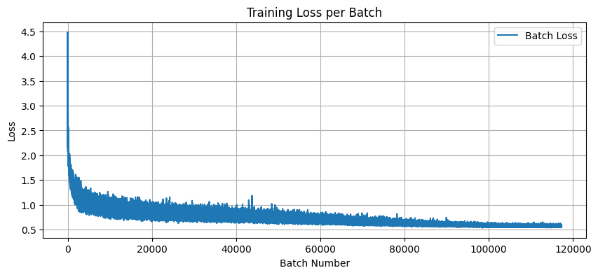
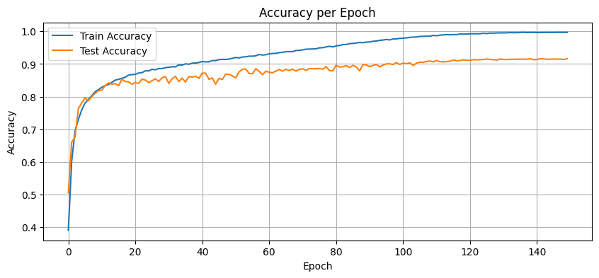

# Neural Networks and Deep Learning Programming Project: Cifar-10 Image Classifier

This repository contains my solution to a programming project for the Neural Networks and Deep Learning course. The task was to design and implement a custom neural network architecture to classify images from the CIFAR-10 dataset. The project involved building the architecture from scratch using PyTorch, training it on CIFAR-10, and evaluating its performance on the test set.

## The prompt: 
Implement a neural network that classifies images in the CIFAR-10 dataset. The CIFAR-10 dataset is composed of 60,000 small images of the same size (3x32x32), each belonging to one of 10 classes. There are 6,000 images per class, and the images are broken up into a training dataset of 50,000 and a test dataset of 10,000.

The task is to create a neural network that classifies the images while following a specific architecture, highlighted below.

### Architecture:
The neural network should be made up of a sequence of intermediate blocks that are followed by an output block. Within each intermediate block, *L* independent convolutional layers (C) should output an image CL(x) from the input image x. Each of these images should be combined into a single output image *x'*, defined by this formula:

*x'* = *a*1C1(x) + *a*2C2(x) + ... + *a*LCL(x)

Where **a** = [a1, a2, ... aL ]T is a vector also computed by the block. In order to compute vector **a**, the average value of each channel (c) of the input image is computed and stored into a c-dimensional vector **m**. The vector **m** is the input to a fully connected layer that outputs vector **a**.

### Output Block:

Finally, the output block should receive an image *x* (the output of the last intermediate block) and output a logits vector **o**. Suppose that the input image *x* has *c* channels. In order to compute the vector **o**, the average value of each channel of *x* should be computed and store into a *c*-dimension vector **m**. Vector **m** is the input to zero or more fully connected layers that output vector **o**.

## Implementation

The network was implemented in Pytorch, closely following the architecture outlined above.

### Data Loading and Augmentation
The CIFAR-10 dataset was loaded and split into train and test sets using the standard split (50,000 train and 10,000 test). Both train and test dataset were transformed to PyTorch tensors and normalized with a mean and standard deviation of (0.5, 0.5, 0.5) for each channel. This brings the pixel values between -1 and 1, allowing for fast and more stable training. The training dataset undergoes augmentation to improve the generalization of the model. This was done
using random crop, random horizontal flip, and ColorJitter. The goal of data augmentation is to increase
the variability of the training dataset, helping the model to learn more robust features and reduce the
chances of overfitting. These three augmentation methods were chosen to tackle spatial and viewpoint
differences in the dataset, as well as color. Previous iterations of the model showed overfitting early on
the epochs, so more data augmentation was added to try to combat this.
The testing dataset was left without any data augmentation to ensure a fair evaluation on unseen data. 

### Block Architecture
The neural network follows the modular, block-based design specified in the project brief. Each block
contains multiple convolutional layers all processing the same input image. These layers are then
combined using the learned attention vector produced by the fully connected layer and the average values
of each channel of the input. This architecture is fully compliant with the specifications of the project. It
was implemented using two main components.

First, a block class which allows the user to define:
- The number of input/output values
- The number of convolutional layers per block
- The kernel size and padding used for the convolutional layers.

Padding ensures that the spatial dimensions are preserved across convolutions, while kernel size
determines the receptive field — larger kernels capture more global features, while smaller kernels focus
on finer local detail.

Within the block architecture, BatchNorm and ReLU layers were included with the convolutional layers
to improve training stability and introduce non-linearity, enabling the model to learn different feature
representations.

Next, the ConvNet class assembles the neural network by stacking multiple blocks. The blocks are
configured using a dictionary, allowing for maximum flexibility and experimentation.

The network begins with a block that uses a larger kernel size (5) to extract broader features, followed by
three blocks with smaller kernels (3) to capture more details and patterns. Each block has the same
amount of convolutional layers (5), determined through testing to be the correct balance between
efficiency and accuracy. Fewer layers did not have the same accuracy, but more layers resulted in both
slower performance and worst accuracy. Each block in the network increases the amount of layers in the
image, starting with the original 3 layers, and ending with 512 from the final block. This is done to widen
the network. The first blocks (especially the first with the kernel size of 5) are used to determine low-level
features within the images, while the later blocks capture deeper patterns and more abstract differences.
This increases the flexibility of the network, and contributes to a higher accuracy.

### Hyperparameters:
The following list summarizes the key training hyperparameters and design choices used in the final
model:
- **Learning rate**: 0.01
- **Optimizer**: AdamW with weight decay = 0.005
- **Loss Function**: CrossEntropyLoss with label smoothing = 0.1
- **Scheduler**: CosineAnnealingLR (T_max = epochs (150))
- **Epochs**: 150
- **Batch size**: 64
- **Dropout**: 0.3 (in final output layer)
- **Weight initialization**: Kaiming initialization for all convolutional and fully connected layers
- **Data Augmentation**:
  - RandomCrop(32, padding= 4)
  - RandomHorizontalFlip
  - ColorJitter (brightness= 0.2, contrast= 0.2, saturation= 0.2)
- **Pooling**: MaxPool2d applied after each block
- **Blocks/convolutional layers**:
  - 4 blocks with 5 convolutional layers each
- **Kernel and padding size**:
  - 1st block: Kernel Size= 5 and Padding= 2
  - 2nd - 4th block: Kernel Size= 3 and Padding= 1

## Results:
The final testing accuracy for the model was 91.62%. The following graphs were produced, showing the
training loss per batch, and the train/test accuracy per Epoch. While the test accuracy remained relatively
consistent toward the end of training, a slight but steady upward trend suggests the model may not have
fully plateaued. It is therefore possible that extending the training beyond 150 epochs (e.g., to 200) could
allow the model to reach or exceed 92% test accuracy.

